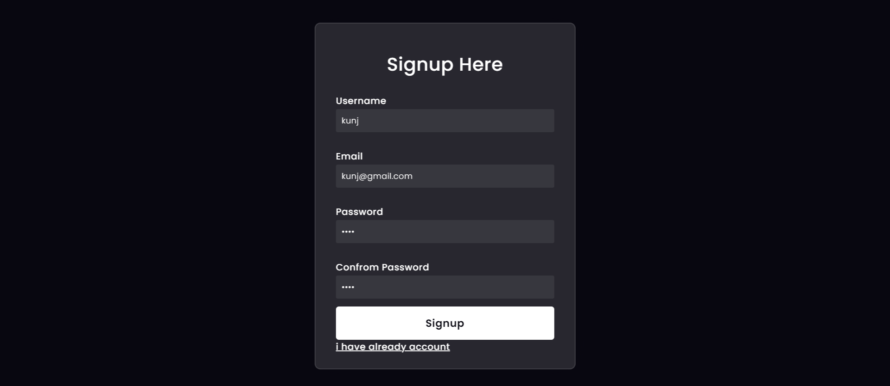
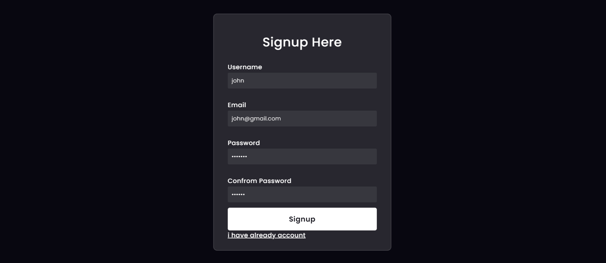
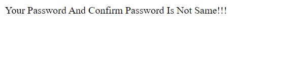
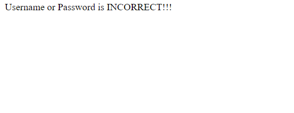

<h1>Signup,Login,Logout Functions</h1>
<h2>In this project i created a signup,login,logout pages and using the python's django framework i add the functionlities </h2>
<h3>Step 1: In signup page filled all details. After that i redirect to login page</h3>

<h3>Step 2: And i wrote username and password which i write in signup page. </h3>

<h3>Step 3: After that i logged in </h3>

<h3>Step 4: After that i logged out and redirtect to signup page and i create another another user in which i wrote not matching password and confirm password  </h3>

<h3>Step 5: So it response   </h3>

<h3>Step 6: After that i come to login page and i wrote a wrong a password which i used signup page password so it response  </h3>

